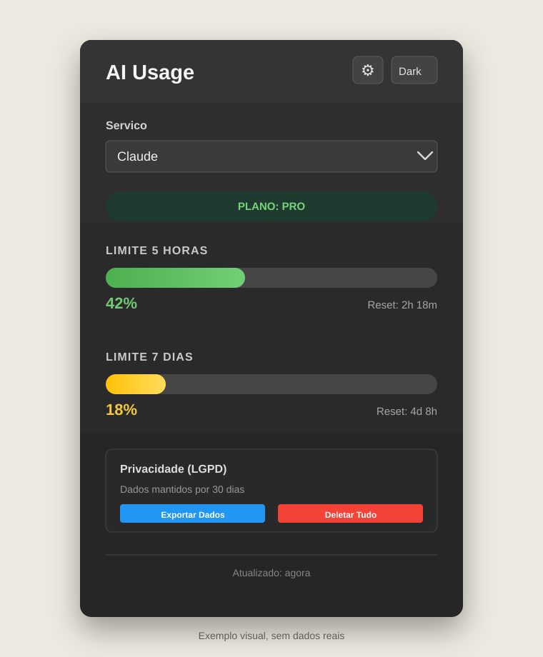

<div align="center">

# AI Usage Monitor

### Extensao Chrome para acompanhar os limites do ChatGPT e Claude

[](#v101)
[](#instalacao)
[](#privacidade)

</div>

## Visao geral

O AI Usage Monitor mostra, no popup e no badge da extensao, o percentual de uso e o horario de renovacao das cotas da conta autenticada. A V1.0.1 monitora ChatGPT e Claude em uma unica extensao.



*Exemplo visual do popup da V1.0.1. Os valores exibidos sao ilustrativos.*

## V1.0.1

Esta atualizacao adiciona o Claude ao monitor que ja acompanhava o ChatGPT.

| Funcionalidade | ChatGPT | Claude |
|---|:---:|:---:|
| Limite de 5 horas | Sim | Sim |
| Limite de 7 dias | Sim | Sim |
| Percentual no badge | Sim | Sim |
| Horario de reset | Sim | Sim |
| Atualizacao manual e automatica | Sim | Sim |

O seletor no popup define qual servico sera exibido e qual percentual aparecera no badge da barra de ferramentas.

## Funcionalidades

- Seletor de servico entre ChatGPT e Claude.
- Percentual de uso para as janelas de 5 horas e 7 dias.
- Contagem regressiva para o proximo reset de cada janela.
- Badge com a metrica de 5 horas ou 7 dias selecionada.
- Cores de alerta: verde, amarelo, laranja e vermelho conforme o consumo.
- Atualizacao automatica a cada 5 minutos e botao para atualizar sob demanda.
- Tema claro, escuro ou automatico.
- Exportacao dos dados locais em JSON.
- Exclusao de todos os dados armazenados pela extensao.

## Download

Baixe apenas a versao que precisa pelo seletor de branches do GitHub:

| Branch | Conteudo |
|---|---|
| [`master`](../../tree/master) | V1.0, monitoramento somente do ChatGPT |
| [`release/v1.0.1`](../../tree/release/v1.0.1) | V1.0.1, monitoramento do ChatGPT e Claude |

Na branch desejada, clique em **Code** e depois em **Download ZIP**. O arquivo baixado contem somente aquela versao da extensao.

## Instalacao

1. Baixe e extraia o ZIP da versao desejada.
2. Abra `chrome://extensions` no Chrome, Edge, Brave ou Arc.
3. Ative o **Modo do desenvolvedor**.
4. Clique em **Carregar sem compactacao**.
5. Selecione a pasta `extension/` extraida do pacote.
6. Fixe a extensao na barra de ferramentas, se desejar.

## Como usar

1. Faca login em [chatgpt.com](https://chatgpt.com) e/ou [claude.ai](https://claude.ai).
2. Abra o popup da extensao e escolha o servico no campo **Servico**.
3. Consulte os limites e os horarios de reset.
4. Em **Configuracoes**, escolha se o badge deve mostrar a janela de 5 horas ou de 7 dias.
5. Use o botao de atualizar quando precisar buscar os dados imediatamente.

Se a conta nao estiver autenticada no servico escolhido, o popup mostrara uma mensagem indicando o site em que o login deve ser feito.

## Tecnologias

| Tecnologia | Uso |
|---|---|
| Chrome Extensions Manifest V3 | Estrutura e ciclo de vida da extensao |
| JavaScript moderno | Consulta, normalizacao e apresentacao dos dados |
| Chrome Storage Local | Preferencias e dados de uso armazenados localmente |
| Chrome Alarms | Atualizacao automatica a cada 5 minutos |
| Fetch API | Requisicoes autenticadas aos servicos web |
| HTML e CSS | Popup responsivo com tema claro e escuro |

## Como funciona

A extensao usa a sessao ja autenticada no navegador. Nenhuma senha e solicitada ou armazenada.

1. Para o ChatGPT, ela obtem o token da sessao e consulta o endpoint de uso autenticado.
2. Para o Claude, ela identifica a organizacao da sessao e consulta o endpoint de uso correspondente.
3. Os formatos recebidos sao normalizados para as mesmas janelas de uso: 5 horas e 7 dias.
4. O resultado e salvo no `chrome.storage.local`; o popup e o badge leem apenas esses dados locais.

Os endpoints utilizados sao internos aos servicos web e podem ser alterados pelos respectivos provedores.

## Privacidade

- Os dados de uso e preferencias ficam no `chrome.storage.local`.
- A extensao nao coleta conversas, prompts, senhas ou historico de navegacao.
- Os dados locais podem ser exportados ou apagados no popup.
- O periodo de retencao configurado e de 30 dias.
- Nao ha analytics nem rastreamento de terceiros.

## Compatibilidade

| Navegador | Suporte |
|---|---|
| Chrome | Completo |
| Edge | Completo |
| Brave | Completo |
| Arc | Completo |
| Firefox | Nao suportado pelo pacote Manifest V3 atual |

## Estrutura

```text
UsoGPT/
|-- extension/                    # Codigo fonte da V1.0.1
|-- docs/screenshots/             # Imagens da documentacao
`-- README.md
```

## Solucao de problemas

| Situacao | Acao recomendada |
|---|---|
| Sem dados para ChatGPT | Confirme o login em `chatgpt.com` e atualize o popup. |
| Sem dados para Claude | Confirme o login em `claude.ai` e atualize o popup. |
| Badge nao atualiza | Recarregue a extensao em `chrome://extensions`. |
| Erro de autenticacao | Saia e entre novamente no servico selecionado. |

## Licenca

Este projeto esta sob a licenca MIT.
