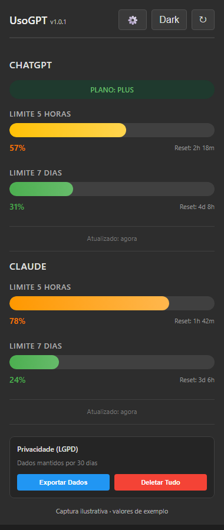
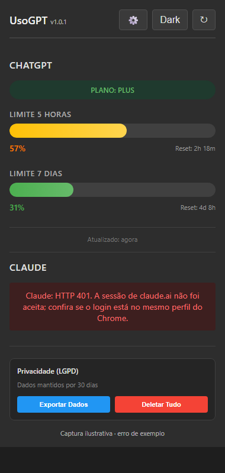

<div align="center">

# UsoGPT - ChatGPT e Claude

### Extensão Chrome para acompanhar ChatGPT e Claude juntos

[](#versão-101)
[](#privacidade-e-lgpd)
[](#instalacao)

---

</div>

## O que é?

Uma extensão Chrome que mostra o consumo do **ChatGPT e do Claude, um abaixo do outro**, sem selecionar ou alternar entre serviços:

- **Limite de 5 horas** - Controle de mensagens por sessao
- **Limite semanal** - Controle de uso total na semana
- **Badge visual** - Percentual de uso do ChatGPT na barra de ferramentas
- **Reset timer** - Countdown ate o proximo reset

---

## Versão 1.0.1: layout e funcionamento

O popup exibe sempre o bloco do **ChatGPT** acima do bloco do **Claude**. Cada um mostra separadamente os percentuais de 5 horas e 7 dias e os respectivos tempos até o reset. Ao abrir o popup, a extensão consulta os dois serviços; o botão ↻ atualiza ambos. Se um deles falhar, o outro permanece visível e o bloco com falha exibe a mensagem recebida. O cabeçalho mostra a versão instalada.

| Consumo dos dois serviços | Erro no Claude, ChatGPT disponível |
|:---:|:---:|
|  |  |

*Capturas ilustrativas renderizadas com o CSS da extensão; valores e erro são exemplos, não dados de contas reais.*

---

## Funcionalidades

| Recurso | Descricao |
|---------|-----------|
| Badge em tempo real | Mostra % de uso do ChatGPT na barra de ferramentas |
| Reset timer | Countdown ate o proximo reset |
| Cores indicativas | Verde (baixo), amarelo (medio), vermelho (alto) |
| Auto-refresh | Atualiza os dois serviços a cada 5 minutos e ao abrir o popup |
| Tema claro/escuro | Opcao de alternancia |
| Dados locais | Salva os resultados no Chrome Storage local |

---

## Instalacao

### Passo 1: Baixe o Projeto

```bash
git clone https://github.com/luucas2030/UsoGPT.git
cd UsoGPT
```

Ou faca download do ZIP e extraia.

### Passo 2: Abra o Chrome

1. Digite `chrome://extensions` na barra de endereco
2. Ative **Modo desenvolvedor** (canto superior direito)
3. Clique em **Carregar extensao descompactada**
4. Para a versão 1.0.1, selecione `releases/UsoGPT-v1.0.1/extension/` (o `manifest.json` está dentro dessa pasta). Também é possível carregar `extension/` na raiz deste projeto, que contém os mesmos arquivos.

### Passo 3: Configure

1. Clique no ícone da extensão (barra de ferramentas).
2. Clique em Configurações apenas se quiser mudar a métrica do **badge do ChatGPT**; os dois serviços continuam visíveis no popup.
3. Escolha qual métrica do ChatGPT mostrar no badge:
   - **5-Hour**: Limite de 5 horas
   - **7-Day**: Limite semanal

### Passo 4: Use

1. Entre em [chatgpt.com](https://chatgpt.com) e [claude.ai](https://claude.ai) no **mesmo perfil do Chrome** em que a extensão está instalada.
2. Abra o popup e confira `v1.0.1` no cabeçalho. ChatGPT aparece acima do Claude.
3. Clique em ↻ para buscar novas leituras. Se um serviço não disponibilizar dados, seu bloco mostrará uma mensagem sem ocultar o outro.

Após modificar os arquivos, clique em **Atualizar** em `chrome://extensions` para recarregar a extensão descompactada.

---

## Estrutura do Projeto

```
UsoGPT/
├── extension/
│   ├── manifest.json      # Configuracao da extensao
│   ├── background.js      # Service worker
│   ├── popup.html         # Interface da extensao
│   ├── popup.js           # Logica da extensao
│   ├── styles.css         # Estilos da extensao
│   └── icons/             # Icones (16, 48, 128px)
├── releases/
│   └── UsoGPT-v1.0.1/
│       └── extension/      # Pacote da versão 1.0.1 para carregar no Chrome
├── docs/screenshots/      # Capturas ilustrativas do layout
├── README.md              # Esta documentacao
└── .gitignore             # Arquivos ignorados pelo Git
```

---

## Privacidade e LGPD

### Compromisso com seus dados

- As leituras ficam no Chrome Storage local; a extensão faz requisições aos sites do ChatGPT e Claude para obtê-las.
- Sem analytics ou tracking
- O código atual tenta sincronizar leituras com `http://127.0.0.1:3000/api/usage/sync` quando houver um serviço local nessa porta.
- Armazenamento local (Chrome Storage)
- Opcao de deletar todos os dados
- O histórico (`usageHistory`) é limpo após 30 dias; a última leitura permanece até ser substituída ou apagada pelo usuário.

### O que NAO coletamos

- Senhas ou credenciais
- Conteudo de conversas
- Dados de navegacao
- Informacoes pessoais identificaveis

### O que coletamos (apenas localmente)

- Percentual de uso de cotas
- Timestamps de medicoes
- Tipo de plano (Plus, Free, etc.)

---

## Como Funciona

### Endpoints Utilizados

A extensão usa a sessão existente no navegador para consultar endpoints internos dos sites do ChatGPT e do Claude (sujeitos a alterações pelos provedores):

```
GET https://chatgpt.com/backend-api/wham/usage
Authorization: Bearer <token da sessao>

GET https://claude.ai/api/organizations
GET https://claude.ai/api/organizations/{uuid}/usage
```

### Dados Coletados

```json
{
  "plan_type": "plus",
  "rate_limit": {
    "primary_window": {
      "used_percent": 45,
      "limit_window_seconds": 18000,
      "reset_at": 1234567890
    },
    "secondary_window": {
      "used_percent": 30,
      "limit_window_seconds": 604800,
      "reset_at": 1234567890
    }
  }
}
```

No Claude, os percentuais vêm dos campos `limits` (`session` e `weekly_all`) ou, como fallback, de `five_hour` e `seven_day`. Quando o serviço não fornece percentuais para a conta, o popup informa que a leitura está indisponível em vez de apresentar `0%`.

---

## Configuracao

### Alterar Intervalo de Atualizacao

Edite `extension/background.js`:

```javascript
const POLL_INTERVAL = 5; // minutos
```

### Alterar Metrica do Badge

1. Clique no icone da extensao
2. Va em Configuracoes
3. Selecione a metrica desejada

---

## Solucao de Problemas

### Badge nao aparece

1. Verifique se esta logado em chatgpt.com
2. Recarregue a pagina
3. Clique no icone da extensao e em "Atualizar"

### Dados nao atualizam

1. Verifique sua conexao com a internet
2. Confirme `v1.0.1` no cabeçalho e clique em ↻ no popup.
3. Em `chrome://extensions`, confirme que a pasta carregada é `releases/UsoGPT-v1.0.1/extension/` e clique em **Atualizar**.

### Claude aparece sem dados, mesmo com login

1. Abra o popup e espere a mensagem `Consultando claude.ai...` mudar para os percentuais ou para um erro específico.
2. Confira se o login em `claude.ai` está no mesmo perfil do Chrome em que a extensão está instalada.
3. Clique em ↻. Caso apareça `HTTP 401` ou `HTTP 403`, a sessão não foi aceita pela API; o código de erro aparece no próprio bloco do Claude.
4. Se o Claude não disponibilizar os percentuais dessa conta, a extensão mostrará essa informação sem esconder o ChatGPT.

### Erro de autenticacao

1. Faca logout do chatgpt.com
2. Faca login novamente
3. Recarregue a pagina

---

## Compatibilidade

| Navegador | Suporte |
|-----------|---------|
| Chrome | Completo |
| Edge | Completo |
| Brave | Completo |
| Arc | Completo |
| Firefox | Parcial |

---

## Licenca

Este projeto esta sob a licença MIT.

---

## Contribuindo

Contribuicoes sao bem-vindas!

1. Fork o projeto
2. Crie uma branch (`git checkout -b feature/nova-feature`)
3. Commit suas mudancas (`git commit -m 'Adiciona nova feature'`)
4. Push para a branch (`git push origin feature/nova-feature`)
5. Abra um Pull Request

---

## Agradecimentos

- [ChatGPT Usage Tracker](https://github.com/mikebutash/openai-codex-usage-chrome) - Inspiracao para extensao

---

<div align="center">

### Se este projeto foi util, deixe uma estrela!

</div>
